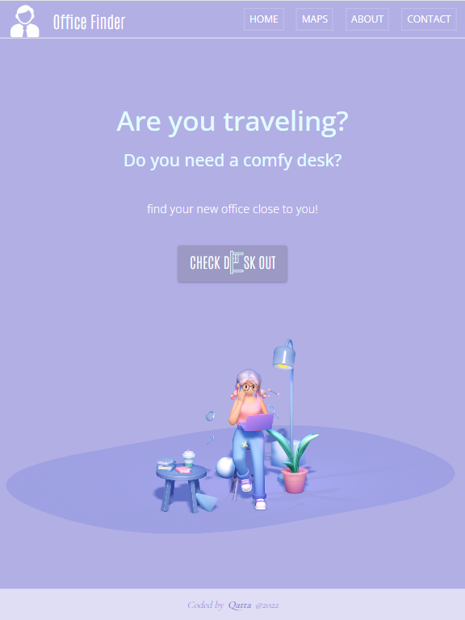
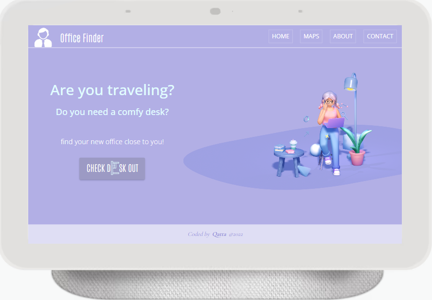

# OFFICE FINDER
> This app is was conceived for the ones that would like to have comfortable place to work remotely from.
> The app is hosted in Vercel [_Check it out._](https://office-finder-qatta93.vercel.app/)

- Are you traveling?
- Don't you have a comfy desk at home?

This app is for you! Different locations. Find the closest one.

## Technologies Used

### Design
- Figma

### Front-end
- TypeScript
- Next.js
- Styled Components
- Spline 3D Design Tool

### Deployment and hosting
- Vercel

## Screenshots

## Project Status
The project is currently on progress, and some additional features will be included in the future.